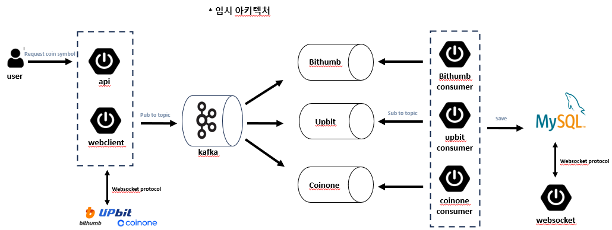

3대 코인 거래소의 실시간 시세 조회, 코인 매수/매도 서비스

- 학습용 개인 프로젝트이며 멀티모듈, kafka, db 관련 학습을 목표로 함
- 3대 거래소의 웹소켓 서버와 연결 후 데이터를 받아와 카프카를 사용해 데이터 유실 방지 및 redis에 적재
- 3개의 토픽에서 초마다 데이터를 적재하는데 있어서 생기는 문제점이 있다면 해결해보기(병목현상, 비동기 처리 등등)
- User의 req/res를 담당하는 api 서버의 아키텍쳐 및 DB 설계